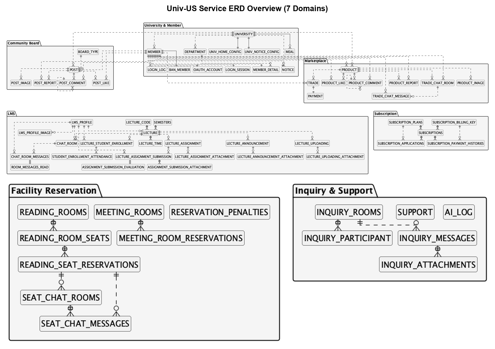
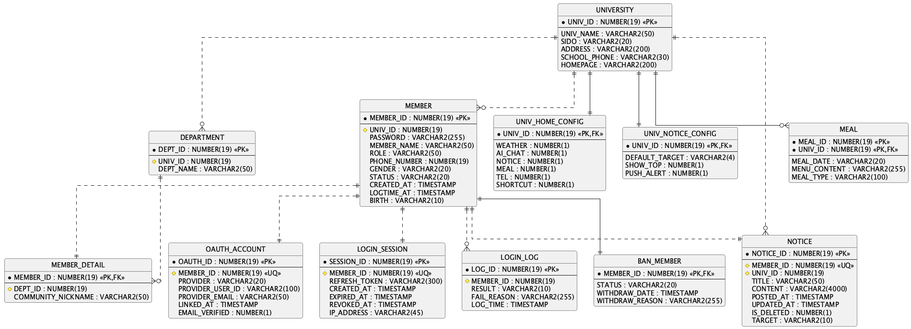
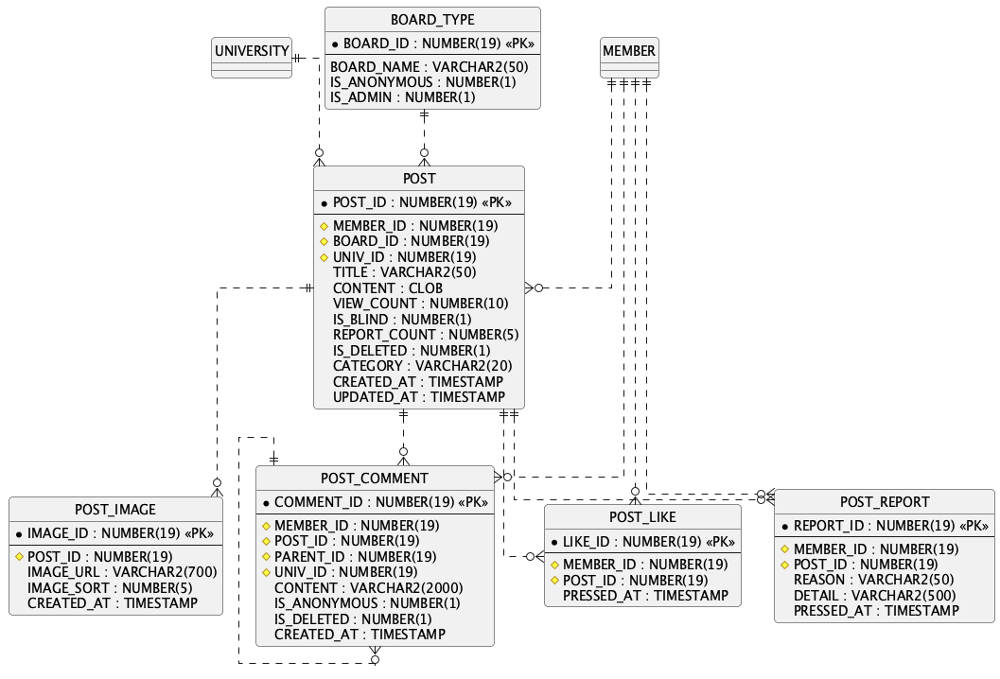
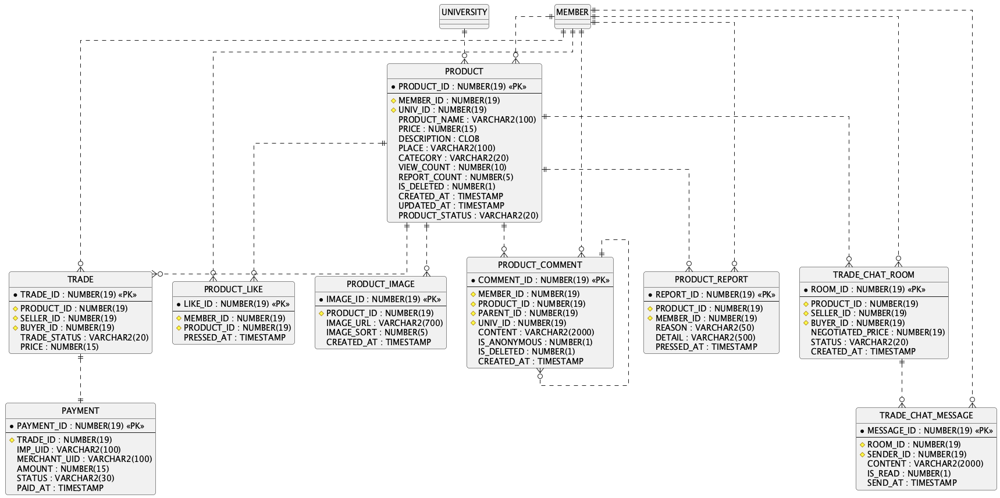
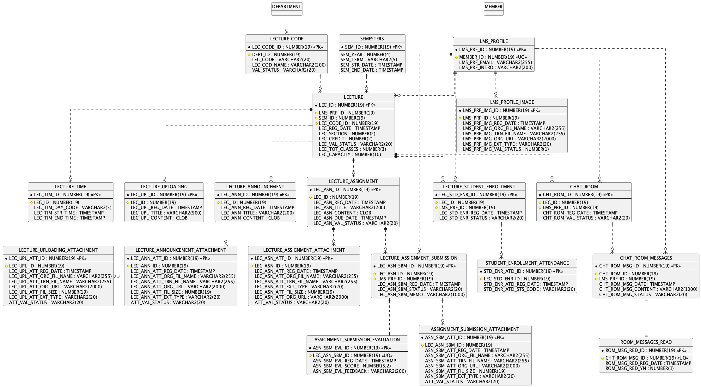
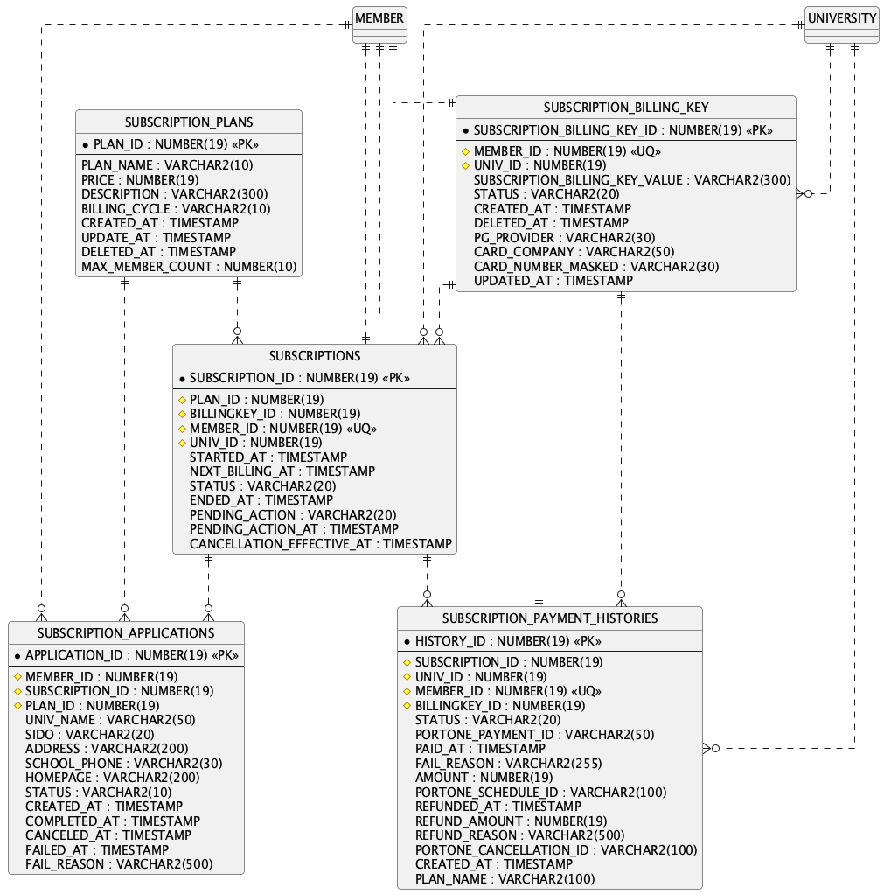
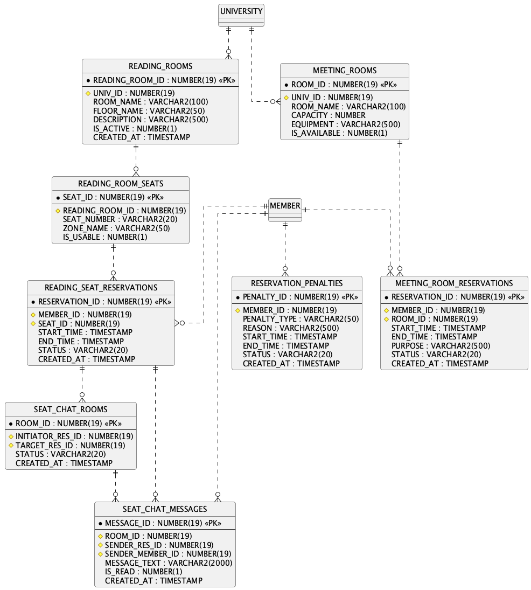
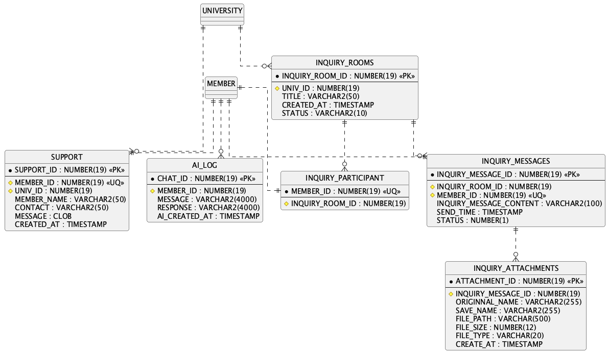

# ERD

DDL을 도메인 7개로 나눠 PlantUML로 렌더링한 이미지입니다. 실선(`──`)은 DDL에 `ALTER TABLE ... FOREIGN KEY`로 명시된 관계, 점선(`┄┄`)은 컬럼 코멘트(`'FK'`)와 `XXX_ID` 네이밍으로 추론한 관계입니다.

## 슬라이드용 한 장 요약 (테이블명 + 관계만)

## 도메인별 상세 (PK/FK 포함 전체 컬럼)

## 1. University & Member

## 2. Community Board

## 3. Marketplace (Product / Trade)

## 4. LMS (Lecture)

## 5. Subscription / Payment

## 6. Facility Reservation (Reading Room / Meeting Room)

## 7. Inquiry / Support / AI

